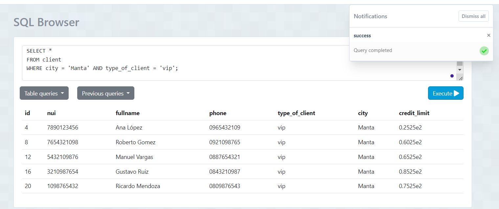
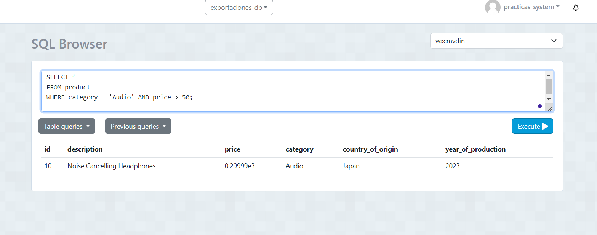
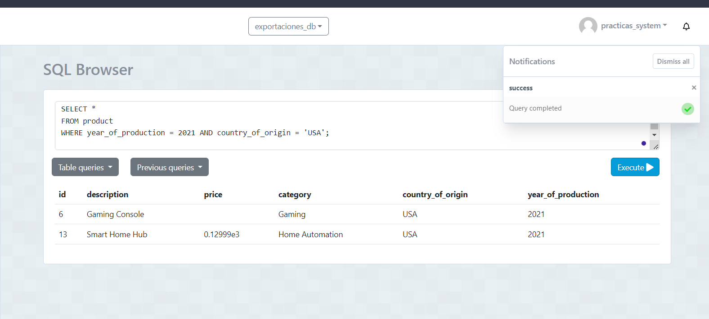
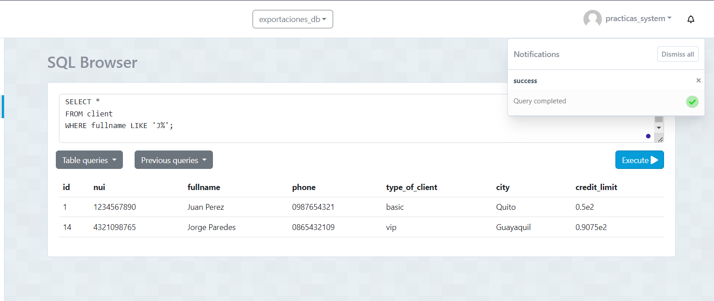
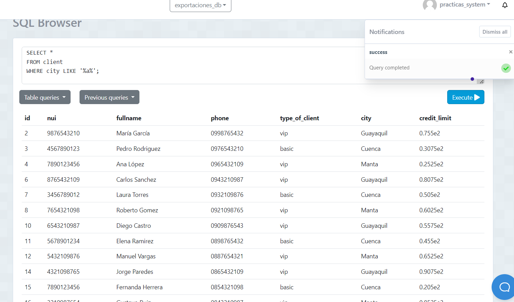

1. Contar el número de productos de una categoría específica:
Sentencia: 

SELECT COUNT(*) AS num_productos
FROM product
WHERE category = 'Audio';

Captura: 

2. Contar el número de clientes en una ciudad específica:
Sentencia: 

SELECT COUNT(*) AS num_clientes
FROM client
WHERE city = 'Cuenca';

Captura: 

3. Contar el número de productos cuyo precio está dentro de un rango específico 
Sentencia: 
SELECT COUNT(*) AS num_productos
FROM product
WHERE price BETWEEN 100 AND 202;

Captura: 

4. Seleccionar clientes que viven en una ciudad específica y tienen un tipo de cliente específico
Sentencia: 

SELECT *
FROM client
WHERE city = 'Manta' AND type_of_client = 'vip';

Captura: 

5. Seleccionar productos que pertenecen a una categoría específica y cuyo precio está por encima de un valor específico
Sentencia: 

SELECT *
FROM product
WHERE category = 'Audio' AND price > 50;

Captura:

6. Seleccionar productos que fueron producidos en un año específico y en un país de origen específico
Sentencia: 

SELECT *
FROM product
WHERE year_of_production = 2021 AND country_of_origin = 'USA';

Captura: 

7. Seleccionar clientes cuyo nombre completo comience con 'J'.
Sentencia: 

SELECT *
FROM client
WHERE fullname LIKE 'J%';

Captura: 

8. Seleccionar clientes cuya ciudad contenga la letra 'a'
Sentencia: 

SELECT *
FROM client
WHERE city LIKE '%a%';

Captura: 

 